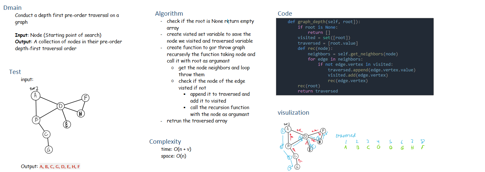

# Class 38 -Graph depth first pre-order traversal

## Challenge

Conduct a depth first pre-order traversal on a graph

## WHITEBOARD

## Approach & Efficiency

Time: O(n + v)
Space: O(n)

## Code

- <a href="#Graph.graph_depth">Graph.graph_depth</a>
## Test

   pytest -k test_graph_depth

tests